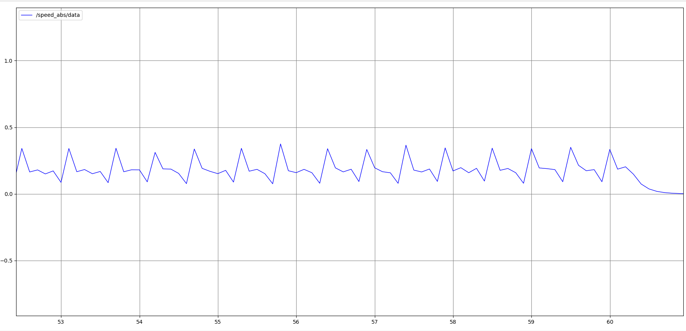

# CSL Rover-Demo
This is software related to the following publications: 

Multicamera Visual SLAM For Vineyard Inspection, submitted at CASE 2023.

[A Sequential MPC Approach to Reactive Planning for Bipedal Robots Using Safe Corridors in Highly Cluttered Environments](https://ieeexplore.ieee.org/document/9878052), 
published in IEEE Robotics and Automation Letters.

The purpose of this package is to enable a rover to navigate a vineyard in a lab setting, using a 
pre constructed map of the environment. With this map as an input, as well as a start and goal point, 
the Reactive planning software outputs a series of waypoints for the rover to follow. 
Using the Multicamera Visual SLAM software for localization and utilizing a pid controller,
the rover follows the waypoints to reach its goal in the vineyard.

The Rover-Demo has been tested with OpenCV 4.2.0, Eigen 3.3.7, ZED SDK 4.0 on Ubuntu 20.04 with ROS Noetic.

## Results

Trajectory drawn on rviz :


Gazebo environment:


Absulute value of velocity in m/s:



Input trajectory (blue), Executed Trajectory (red):


# Installation

CSL Rover-Demo has many dependencies and all can be downloaded using a script provided in this repo. ROS Noetic is needed for the installation. Instructions on how to install ROS Noetic can be found [here](http://wiki.ros.org/noetic/Installation).

We recommend the users to create an empty workspace. Clone the package on the catkin workspace and run the build script. Python 3 has to be set as default for the installation.

```
cd ${WORKSPACE_PATH}/src
git clone https://JohnZar@bitbucket.org/csl_legged/rover_demo.git
cd rover_demo
chmod +x build.sh
./build.sh
```

# Quick Start

Several launch files are provided. To quickly recreate the simulated experiment run in a new terminal:

```
cd ${WORKSPACE_PATH}
source devel/setup.bash
roslaunch nexus_4wd_mecanum_gazebo poulakakis_smooth_pid.launch 
```
Then in a separate terminal, to obtain odometry from the dual camera VSLAM:

```
cd ${WORKSPACE_PATH}
source devel/setup.bash
roslaunch dc_vslam DualCamRTAT-2.launch
```
Then in a separate terminal, to publish the path generated from the safe corridors software:

```
cd ${WORKSPACE_PATH}
source devel/setup.bash
rosrun nexus_4wd_mecanum_gazebo from_file_waypoint_publisher1
```

